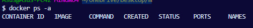
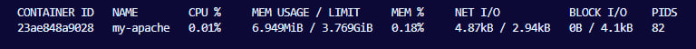
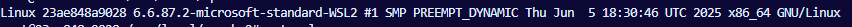
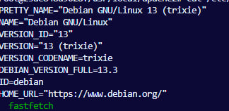
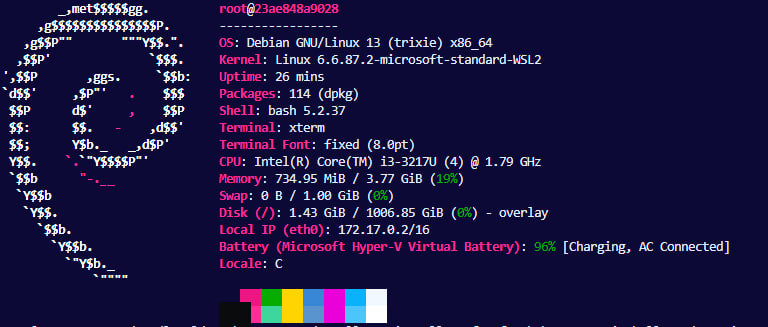
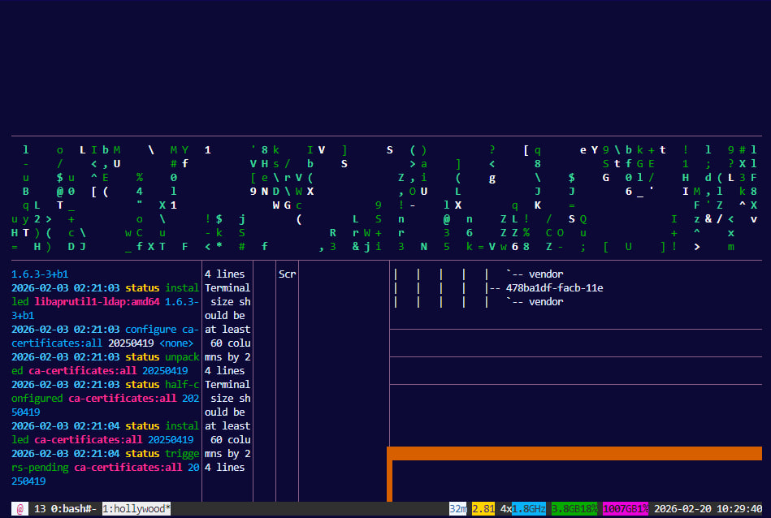
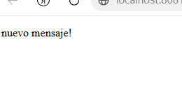

## Практическая работа на примере готового образа Apache в Docker

> **Apache** - это легкий и небольшой веб-сервер

### Проверить Docker

Получить версию установленного у вас Docker
```shell
docker version
```


> Готовые образы берутся из сторонних источников: **Docker Hub** или другие

[Ссылка на Docker Hub](https://hub.docker.com/)

### Подготовка Docker (чтобы начать работать с "чистого листа")

1. Остановить все запущенные контейнеры
1. Удалить все остановленные контейнеры
1. Удалить все неиспользуемые образы

- Следует убедиться, нет ли у вас уже установленных и запущенных контейнеров:
```shell
docker ps -a
```
- Если есть, то лучше их остановить:
```shell
docker stop $(docker ps -q)
```
- Если остановленные контейнеры не нужно, то удалить их:
```shell
docker container prune
```
или
```shell
docker container prune $(docker ps -q)
```
- Ещё раз убедиться, что нет лишних контейнеров:
```shell
docker ps -a
```



- Опционально можно удалить ненужные образы. Показать текущие образы:
```shell
docker images
```
Удалить все ненужные образы
```shell
docker image prune -a
```
или
```shell
docker rmi $(docker images -q)
```

> Удалять нужно только учебные контейнеры и образы, т.к. есть риск потерять важные данные, которые могут содержаться в контейнерах!

### Получение готового образа apache

1. Поиск и получение готового образа на Docker Hub
1. Создание и запуск контейнера из полученного образа
1. Проверка состояния приложения из Docker-контейнера
1. Управление контейнером

Найти нужный образ на **Docker Hub**
```shell
docker search apache
```


Получить, создать и запустить apache
```shell
docker run -d --name my-apache -p 80:80 apache
```

Показать загруженный на ваш компьютер образ
```shell
docker images
```

Если нужно только получить готовый образ, без создания и запуска контейнера, то
```shell
docker pull apache
```

Получить информацию по загруженному образу:
```shell
docker inspect apache
```

При необходимости остановить контейнер с таким именем:
```shell
docker stop my-apache
```
Перезапустить контейнер по имени
```shell
docker restart my-apache
```
Перезапустить контейнер по его **id**
```shell
docker restart 2e6c42d9b6af
```

Удалить выбранный контейнер по его имени
```shell
docker rm my-apache
```


И можно удалить ещё и образ загруженного ранее apache:

Получить id образа
```shell
docker images
```

Удалить по `id` нужный образ
```shell
docker rmi 062a783918fb
```


### Проверить работу контейнера

Можно снова установить и запустить apache (если его удаляли ранее)

Показать работающий apache

Способ 1
```shell
curl http://localhost/
```


Способ 2 - [открыть http://localhost/ адрес в браузере](http://localhost/)


### Управление контейнером

#### Мониторинг контейнеров

Показать состояние всех контейнеров
```shell
docker ps -a
```

Показать подробности о контейнере
```shell
docker inspect my-apache
```

Запустить мониторинг контейнеров
```shell
docker stats
```




> Выйти из мониторинга контейнеров можно по `Ctrl+C`

Получить лог контейнера
```shell
docker logs my-apache
```

Показать логи в режиме ожидания
```shell
docker logs -f my-apache
```
> Выйти из логов в режиме ожидания можно по `Ctrl+C`


### Управление контейнером

Остановить контейнер
```shell
docker stop my-apache
```

Снова запустить контейнер
```shell
docker start my-apache
```

Перезапустить контейнер
```shell
docker restart my-apache
```

Зайти в контейнер
```shell
docker exec -it my-apache /bin/bash
```
или
```shell
docker exec -it my-apache bash
```
или
```shell
docker exec -it my-apache /bin/sh
```
или
```shell
docker exec -it my-apache sh
```

внутри контейнера можно повыполнять некоторые команды Linux
Получить информацию об ОС контейнера
```shell
uname -a
```


Получить больше информации об ОС контейнера
```shell
cat /etc/os-release
```


Установить **Fastfetch**
```shell
apt update && apt install -y fastfetch
```
> apt update - обновит списки источников приложений, apt install - установит указанное приложение
Запустить **Fastfetch**
```shell
fastfetch
```


Можно установить ещё несколько приложений внутри Docker-контейнера:
```shell
apt update && apt install -y fastfetch htop cmatrix hollywood mc micro
```
> На все вопросы ответьте `1` и `Enter`

и позапускать их отдельно друг от друга:
```shell
htop
```


> Выйти из `htop` можно по **Q**

```shell
cmatrix
```


> Выйти из `cmatrix` можно по **Q**

```shell
hollywood
```


> Выйти из `hollywood` можно по `Ctrl-C`

Выйти из контейнера можно командой `exit`

Отредактировать текст страницы приветствия apache (Находится в разработке!)

Открыть файл `index.html` для редактирования содержимого
```shell
micro /usr/local/apache2/htdocs/index.html
```

отредайтируйте и сохраните по `Ctrl+S` и выйти из режима редактирования по `Ctrl+Q`

[Проверить изменения на открытой странице >>](http://localhost/)



Остановить все запущенные контейнеры
```shell
docker stop $(docker ps -q)
```

Удалить все остановленные контейнеры
```shell
docker container prune $(docker ps -q)
```

Удалить все образы
```shell
docker rmi $(docker images -q)
```